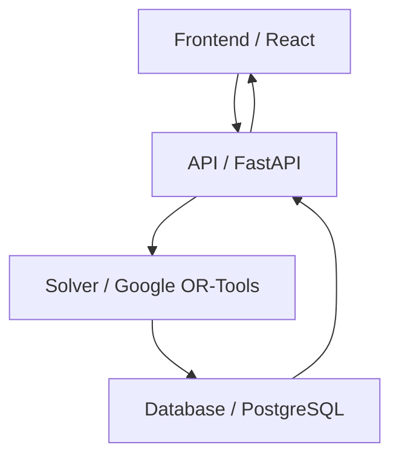

# Project Overview

このプロジェクトは、複雑な制約条件を持つスケジュール作成業務を自動化するために開発されました。
Google OR-Tools（数理最適化ソルバー）を使用し、人間の手では数時間かかる作成作業を数秒で完了させます。

## Key Features

### 🧩 複雑な制約への対応
- スタッフの希望シフト
- 必要人数の要件
- 連続勤務の制限
- スキルセットによる配置要件

これら全ての条件を満たす最適解を導き出します。

### ⚡ 高速な計算処理
独自のヒューリスティックとOR-Toolsの組み合わせにより、計算時間を大幅に短縮しました。

## System Architecture

## Future Improvements

- [ ] AIによる需要予測の導入
- [ ] モバイルアプリ化
- [ ] リアルタイム通知機能
